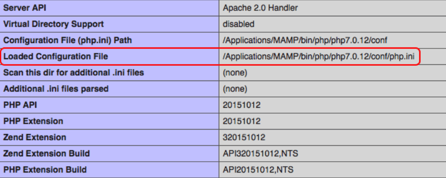
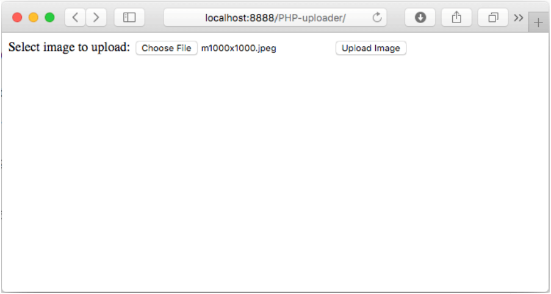

PHP is one of the most popular programming languages for handling server-side applications of websites and web services. It includes all the functions to upload, validate and verify files uploaded from the client side. A file upload script can be made in under 5 minutes.

With little effort, you can create a server script that will, for example, let users upload profile pictures onto your website and stack them in one folder. The uploader itself is relatively easy, but other tasks, such as fast file delivery to a client machine through a CDN, or adding a watermark to image uploads, will require more complex solutions.

In this article, we’ll cover the following two options and reveal their pros and cons:

- Upload files onto your own server and create a PHP server upload script from scratch.
- Use a service like Uploadcare via PHP that handles uploading, storing and delivering files through a CDN (AWS).

## Create a PHP file uploader on your own

If you need to create a basic file uploader and you don’t expect thousands of image files flooding your server’s storage from users around the world, do it yourself. Also, this solution is good for very specific uploading tasks and closed systems (banks, defense, and government facilities) with strict policies that don’t allow file upload outsourcing to a third-party service.

### Items

#### Pros

- Full control over the uploading process.
- Simple (or not, depending on your requirements).
- Free solution (provided that development costs are free on your end).

#### Cons

- Takes a lot of time to create and customize PHP uploader (validation, processing).
- Even more time to make a service that can withstand high loads and prevent errors.
- Slower file delivery, because no CDN is involved. Setting up a CDN uploader is another task that won’t be covered in this article.
- Takes additional resources to support and maintain the script in the future.
- Doesn’t work for mobile apps out of the box (needs further bridging with your app’s architecture).
- Security concerns — hackers love homemade scripts.

### Prerequisites

To follow along with this article, you’ll need to have a web server (Apache, nginx, etc.) with any of the recent PHP versions installed (version 7.x includes [a few Session and CURL improvements](https://www.php.net/ChangeLog-7.php) regarding file uploading).

### Configuring PHP

Make sure that the php.ini config file allows uploading files (it’s turned on by default). Also, you can set some restrictions, such as a maximum size for an uploaded file, number of files uploaded per chunk, etc. Here is the part of this initialization file that’s related to file uploading:

```ini
;;;;;;;;;;;;;;;;
; File Uploads ;
;;;;;;;;;;;;;;;;

; Whether to allow HTTP file uploads.
file_uploads = On

upload_tmp_dir = /Applications/MAMP/tmp/php

; Maximum allowed size for uploaded files.
upload_max_filesize = 2M

; Maximum number of files that can be uploaded via a single request
max_file_uploads = 20
```

### How to locate the php.ini file

If you can’t locate the php.ini file on your computer, create a script with the following command:

```php
phpinfo();
```

And then launch it in your web browser. It’ll show you the path to the initialization file, like in the screenshot below:



### HTML file uploading methods

Typically, there are two general file uploading methods in the [HTML specification](https://www.w3.org/Protocols/rfc2616/rfc2616-sec9.html#sec9.5): POST, which we’ll be using in this article; and PUT, which is mostly used to replace existing files with a specific resource ID, and is potentially [more dangerous](https://www.php.net/manual/en/features.file-upload.put-method.php) to use, so we’ll skip it.

There are two general types of file that can go via POST: **text files** and **binary files**. Image files (.jpg, .png, .gif, etc.) are binary files, so we’ll be working with that type. By the way, in HTML, this encoding type is described as a `multipart/form-data`.

### Step 1. Creating an HTML form

First, we need to take care of the client-side code in HTML and create a form that’ll allow users to select files for uploading.

Create a `PHP-upload` project folder in the root directory of your website (e.g., `public_html`, `htdocs`, or `www`), and then create a new `index.html` file there.

Copy & paste the following code into your newly created file. It features a simple form with a file select input and a submit button:

```html
<!DOCTYPE html>
<html>
<body>
  <form action="uploadHandling.php" method="post" enctype="multipart/form-data">
    Select image to upload:
    <input type="file" name="fileToUpload" id="fileToUpload">
    <input type="submit" value="Upload Image" name="submit">
  </form>
</body>
</html>
```

The form `action` refers to the script that’ll take care of the upload processes on the server side. As we mentioned earlier, the data delivery method will be `POST`.

`enctype` is set to `multipart/form-data`, meaning that you’re using forms that have a file upload control, and no characters are encoded.

### Step 2. Creating a PHP file uploading script

The server script name should match the name we mentioned in the HTML. Create a folder called `uploads` in the directory of your project. It’ll store the incoming files.

Copy and paste this `uploadHandling.php` script as a server-side solution for your file/image uploader.

```php
// Config
$currentDirectory = getcwd();
$uploadDirectory = '/uploads/';
$fileExtensionsAllowed = ['jpeg', 'jpg', 'png']; // These will be the only file extensions allowed
$fileLimitMb = 5; // File limit in MB
$uploadOk = true;

$fileName = $_FILES['fileToUpload']['name'];
$fileSize = $_FILES['fileToUpload']['size'];
$fileTmpName  = $_FILES['fileToUpload']['tmpName'];
$fileType = $_FILES['fileToUpload']['type'];
$fileExtension = strtolower(end(explode('.', $fileName)));

$uploadPath = $currentDirectory . $uploadDirectory . basename($fileName);

// Check if image file is an actual image or fake image
if (isset($_POST['submit'])) {
  if (getimagesize($fileTmpName) !== false) {
    echo 'File is an image - ' . $check['mime'] . '.';
    $uploadOk = true;
  } else {
    echo 'File is not an image.';
    $uploadOk = false;
  }
}

// Check if file already exists
if ($uploadDirectory . basename($fileName) {
  echo 'File already exists.';
  $uploadOk = false;
}

// Check file size
if ($fileSize > ($fileLimitMb * 100000)) {
  echo 'File must be less than ' . $fileLimitMb . 'MB.';
  $uploadOk = false;
}

/*
// Allow certain file formats; needs to do foreach from array fileExtensionsAllowed
if ($imageFileType != $fileExtensionsAllowed  {
  echo 'Sorry, only JPG, JPEG, PNG & GIF files are allowed.';
  $uploadOk = false;
}*/

// Check if $uploadOk then process
if ($uploadOk == false) {
  echo 'File couldn\'t be uploaded.';
} else {
  if (move_uploaded_file($fileTmpName, $target_file)) {
    echo 'The file ' . basename($fileName) . ' has been uploaded.';
  } else {
    echo 'Sorry, there was an error uploading your file.';
  }
}
```

Let me break it down for you and describe the details, so we’re on the same page regarding exactly what this script does.

The `$_FILES` object contains all the means of accessing a file and its properties, such as name, size, and file extension.

- `$_FILES['userfile']['name']` — the original name of the file uploaded by the client.
- `$_FILES['userfile']['type']` — the file’s MIME type (e.g., "image/gif" for images) provided by the browser.
- `$_FILES['userfile']['size']` — the file size in bytes.
- `$_FILES['userfile']['tmp_name']` — the name under which the newly uploaded file is put on the server before all checks are completed (e.g., if there is a file with the same name).

We’ll include the necessary basic checks on file type (because in our case it must be a picture) and file size (e.g., less than 2MB).

Don’t forget that you can set absolute maximums for file uploads in `php.ini`. This particular script will have its own custom limits for this image uploading task.



You’ll need to create your own CSS for the HTML uploader form to make it look nice. It’s not a disadvantage as it doesn’t affect functionality, but it’ll probably require some time as well.

### Final thoughts on uploading with your own PHP script

This script is just the tip of the iceberg. There are tons of other tasks related to the file uploading process, such as distributing files across servers for optimal delivery, image processing (e.g., crop and other effects), etc.

The code above is a clear and slightly refined version of an example script that you might find with a more detailed explanation at [php.net](https://www.php.net/manual/en/features.file-upload.post-method.php), [w3schools.com](https://www.w3schools.com/php/php_file_upload.asp), and other websites. The one from this article has been tested and it’s ready to go. Plus, it includes basic checks, because it’s important not to mess up your server when making it available to the public.

## Use Uploadcare to upload images

If you need a fast, reliable and robust solution to take care of your image uploads, simply call Uploadcare’s functions from your PHP scripts. It’ll give you more reliability, and the uploads will be completed faster.

### Items

#### Pros

- Super-fast setup and customizable interface.
- Works for web and mobile.
- Manages storage and works with CDN automatically.
- Technical support if you ever run into a problem.
- Additional features, such as resizing, cropping images, etc.
- Allows users to import files from multiple sources.
- CSS appearance can be easily customized.

#### Cons

- May not work for very specific uploading procedures (API includes methods that cover almost all tasks related to image uploading).
- Doesn’t work for large files (100 MB or more, depending [on your plan](https://uploadcare.com/pricing/)).
- It’s not possible to get a simple on-premise installation package, so it might not work for systems that have limited Internet access.
- The service is not free, but it offers packages that should suit most businesses’ needs and budgets.

Actually, you can access Uploadcare methods through HTML/JS, so PHP isn’t necessary at all. However, Uploadcare provides you with a well-documented API that you can use from within your PHP-written backoffice.

See this very detailed guide on installing Uploadcare libraries via Composer, getting API keys and switching: [Serverless File Uploads in PHP →](https://uploadcare.com/docs/guides/php/)

After it’s done, getting your images onto the CDN server using Uploadcare will be as easy as these few lines of code:

```php
<!DOCTYPE html>
<html>
<head>
  <script>
    UPLOADCARE_PUBLIC_KEY = 'YOUR_PUBLIC_KEY';
  </script>
  <?php echo $api->widget->getScriptTag(); ?>
</head>
<body>
<form method="POST" action="index.php">
  <?php echo $api->widget->getInputTag('qs-file'); ?>
  <input type="submit" value="Save!" />
</form>
</body>
</html>
```

When you launch this code in a browser, you’ll see the widget appear, which means you can go ahead and start uploading:


## Transition from PHP uploader to Uploadcare

We at Uploadcare have been through lots of struggles with file uploading. Finally, we decided there must be a better way, so we created a service that makes it simple for you.

If you don’t want your business to stall because of this small yet ultimately complex task, [try Uploadcare now](https://uploadcare.com/quick_start/). Why walk to the airport when you can take a cab?
