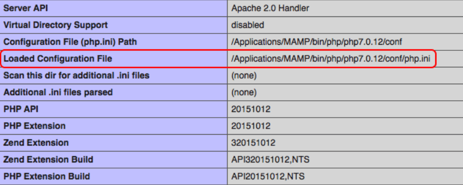
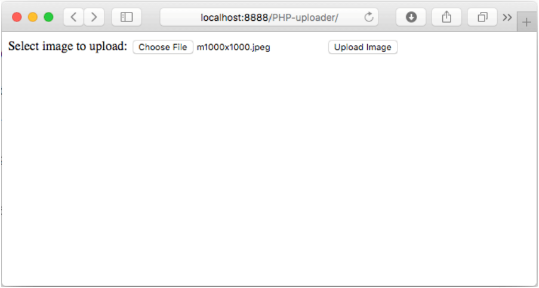
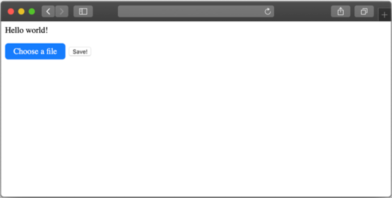

PHP has excellent built-in support for handling file upload and validation logic. A basic, functional file upload script can be made in under 5 minutes.

This basic script could, for example, let users upload profile pictures onto your website and stack them in one folder. While the uploader itself is relatively easy, other tasks, such as fast file delivery to a client machine through a CDN, or adding a watermark to image uploads, will require more complex solutions. And it's also important to consider security risks and other malicious uses of the upload form.

In this article, we’ll cover the following two options and reveal their pros and cons:

- Upload files onto your own server and create a PHP server upload script from scratch.
- Use a service like Uploadcare via PHP that handles uploading, storing and delivering files through a CDN (AWS).

## Create a file upload in PHP on your own

If you need to create a basic file uploader and you don’t expect thousands of image files from users around the world, it might be okay to do it yourself.

### Items

#### Pros

- Full control over the uploading process.
- Simple (or not, depending on your requirements).
- Free solution (provided that development and storage costs are free on your end).

#### Cons

- Takes a lot of time to create and customize PHP uploader (validation, processing).
- Even more time to make a service that can withstand high loads and prevent errors.
- Slower file delivery, because no CDN is involved. Setting up a CDN uploader is another task that won’t be covered in this article.
- Takes additional resources to support and maintain the script in the future.
- Doesn’t work for mobile apps out of the box (needs further bridging with your app’s architecture).
- More storage needed on the server, along with a backup plan for all the user-uploaded content.
- Security concerns — malicious files, denial of service attacks, invalid validation logic, and more.

### Prerequisites

To follow along with this article, you need a [supported version of PHP](https://www.php.net/supported-versions.php) installed. You can either use a server like nginx and Apache, or try the demo with PHP's [built-in development server](https://www.php.net/manual/en/features.commandline.webserver.php).

### Configuring PHP

By default, PHP is configured to allow file uploading, and has sensible defaults for the maximum number of files and file sizes that can be uploaded.

If you need to troubleshoot file uploading, or adjust any of the limits, you can do this in the `php.ini` configuration file. The most relevant file upload configuration options are shown here:

```ini
;;;;;;;;;;;;;;;;
; File Uploads ;
;;;;;;;;;;;;;;;;

; Whether to allow HTTP file uploads.
file_uploads = On

upload_tmp_dir = /Applications/MAMP/tmp/php

; Maximum allowed size for uploaded files.
upload_max_filesize = 2M

; Maximum number of files that can be uploaded via a single request
max_file_uploads = 20
```

### How to locate the php.ini file

If you can’t locate the php.ini file on your computer, create a script with the following command:

```php
phpinfo();
```

And then launch it in your web browser. It’ll show you the path to the initialization file, like in the screenshot below:



### How browsers upload files

HTML provides a [`file` input type](https://developer.mozilla.org/en-US/docs/Web/HTML/Element/input/file) that allows users to select a file from their local computer. This input has several attributes for configuring what types of files you want the user to be able to upload.

Use of the file input also requires that you set some corresponding attributes on the HTML form. Most mportantly, the `enctype` attribute needs to be `multipart/form-data` and the `method` attribute needs to be `POST`. This tells the browser that the form contains binary data, and that it should be encoded for transmission.

When the user submits the form, the browser sends the file to the server using a single POST request. Depending on the user's upload connection speed and the size of the file, this upload request could take quite some time. Setting reasonable defaults will prevent the request from timing out.

### Step 1. Creating an HTML form

First, we need to take care of the client-side code in HTML and create a form that’ll allow users to select files for uploading. We're going to keep this form very basic, but in a real world application you'd want to set attributes to limit file types, file sizes, and more.

Create a new `index.html` file within your sample web application. Copy and paste the following code into your newly created file. It features a single file select input and a submit button. We've also set up the HTML form with the proper `enctype` and `method` attributes to support binary file uploads.

```html
<!DOCTYPE html>
<html>
<body>
  <form action="uploadHandling.php" method="post" enctype="multipart/form-data">
    Select image to upload:
    <input type="file" name="fileToUpload" id="fileToUpload">
    <input type="submit" value="Upload Image" name="submit">
  </form>
</body>
</html>
```

The resulting form should look like this:



As you can see, this form is using default styling. You’ll need to create your own CSS for the HTML uploader form to make it look nice.

The form's `action` attribute refers to the script that will recieve the uploaded file and process it on the server side. We'll create this script in the next step.

### Step 2. Creating a PHP file uploading script

The server script name should match the name we mentioned in the HTML. Create a folder called `uploads` in the directory of your project. It’ll store the incoming files.

> [!IMPORTANT]  
> In a production application, you should store uploaded files outside of the web root directory. This prevents users from being able to access files directly, which can expose you to security risks.

Copy and paste this `uploadHandling.php` script as a server-side solution for your file/image uploader. Comments are provided to explain the basic functionality of each block of code. In this sample code, we're only allowing certain image file types to be uploaded, and we're limiting the file size to 5 megabytes.

```php
<?php

declare(strict_types=1);

// redirect to upload form if no file has been uploaded
if (!isset($_FILES['fileToUpload']) || $_FILES['fileToUpload']['error'] > 0) {
    header('Location: index.html');
    exit;
}

// configuration
$uploadDirectory = getcwd() . '/uploads/';
$fileExtensionsAllowed = ['jpeg', 'jpg', 'png']; // These will be the only file extensions allowed
$mimeTypesAllowed = ['image/jpeg', 'image/png']; // These will be the only mime types allowed
$maxFileSizeInBytes = 5_242_880; // 5 megabytes

// extract data about the uploaded file
['name' => $fileName, 'tmp_name' => $fileTempName, 'type' => $fileType, 'size' => $fileSize] = $_FILES['fileToUpload'];
['extension' => $fileExtension] = pathinfo($fileName);

$errors = [];

// validate the file extension is in our allow list
if (!in_array($fileExtension, $fileExtensionsAllowed)) {
    $errors[] = 'File must have one of the following extensions: ' . implode(', ', $fileExtensionsAllowed) . '.';
}

// validate the file is an allowed mime type based on actual contents
$detectedType = mime_content_type($fileTempName) ?: 'unknown type';
if (!in_array($detectedType, $mimeTypesAllowed, strict: true)) {
    $errors[] = 'File type is unsupported: ' . $detectedType . '.';
}

// validate if the file already exists
$uploadPath = $uploadDirectory . $fileName;
if (file_exists($uploadPath)) {
    $errors[] = 'File already exists.';
}

// validate the maximum file size
if ($fileSize > $maxFileSizeInBytes) {
    $errors[] = 'File must not be greater than ' . number_format($maxFileSizeInBytes) . ' bytes.';
}

// attempt to move the file, but only if there were no errors up to this point
if (count($errors) === 0) {
    if (move_uploaded_file($fileTempName, $uploadPath)) {
        echo 'The file has been successfully uploaded.';
    } else {
        $errors[] = 'Sorry, there was an error uploading your file.';
    }
}

// display any errors
if (count($errors) > 0) {
    echo '<h3>Errors:</h3>';
    echo '<ul>';
    foreach ($errors as $error) {
        echo '<li>' . $error . '</li>';
    }
    echo '</ul>';
}
```

When PHP receives file uploads, it populates a global `$_FILES` object with the uploaded file contents, and some file properties, such as name, size, and error status.

The file's type is provided by the client, and should not be trusted, which is why we use PHP's built in `fileinfo` extension to determine the acutal MIME type for validation.

We also receive both the original name of the file, as well as the temporary name PHP assigned. All uploaded files are placed into a temporary upload directory. If validation passes, and ONLY if it passes, then we move the temporary file to the desired location.

> [!IMPORTANT]  
> For purposes of this example, we're not allowing a user to upload a file with a name that already exists. In a real production application, you'd likely sandbox user uploads per account or add additional logic to prevent overwriting existing files.

In regards to file size validation, don’t forget that the limits we're enforcing in this PHP script are separate from any limits enforced in the `php.ini` configuration, or in your web server configuration.

### Final thoughts on uploading with your own PHP script

This script provides a basic demonstration of simple uploading functionality. There are many other tasks related to the file uploading process to consider, such as distributing files across servers for optimal delivery, image processing (e.g., crop and other effects), malicious file detection, etc.

## Use Uploadcare to upload files

If you need a fast, reliable and robust solution to take care of your image uploads, simply call Uploadcare’s functions from your PHP scripts. It’ll give you more reliability, and the uploads will be completed faster.

Or you can bypass PHP altogether and embed Uploadcare methods through HTML and Javascript. Either option is available.

### Items

#### Pros

- Super-fast setup and optimized upload speed.
- Works for web and mobile.
- Professional default UI, but appearance can also be customized with CSS.
- Manages storage and works with CDN automatically.
- Additional features, such as resizing, cropping images, inappropriate image detection, etc.
- Stronger security protection, including virus scanning.
- Allows users to import files from multiple sources.
- Technical support if you ever run into a problem.

#### Cons

- It’s not possible to get a simple on-premise installation package, so it might not work for systems that have limited Internet access.
- The service is not free, but it offers packages that should suit most businesses’ needs and budgets.

### Prerequisites
Your environment will need to meet the [Uploadcare requirements](https://uploadcare.com/docs/integrations/php/#requirements) and it is recommended to use [Composer](https://getcomposer.org) to [install the Uploadcare PHP library](https://uploadcare.com/docs/integrations/php/#install).

After it’s done, getting your images onto the CDN server using Uploadcare is fairly straightforward, and unlocks a lot of application functionality, such as virus scanning, image detection, optimization, and more.

The provided Uploader widget also supports lots of advanced functionality like multiple file upload. You can also use it to upload files from an attached camera, a URL, Dropbox, Google Drive, and other sources.

```php
<?php

declare(strict_types=1);

require __DIR__.'/../vendor/autoload.php';

const PUBLIC_API_KEY='YOUR_PUBLIC_API_KEY';
const PRIVATE_API_KEY='YOUR_PRIVATE_API_KEY';

// check if the uploaded file is infected
if (isset($_POST['my-uploader'])) {
    $config = Uploadcare\Configuration::create(PUBLIC_API_KEY, PRIVATE_API_KEY);
    $fileApi = (new Uploadcare\Api($config))->file();

    $uploadedFileId = basename($_POST['my-uploader']);
    $file = $fileApi->fileInfo($uploadedFileId);
    $isInfected = $file->getAppdata()->getClamAvVirusScan()->getData()->isInfected();

    // any other logic here to write to database, send email notification, etc.
}
?>
<!DOCTYPE html>
<html>
<head>
    <script type="module">
        import * as LR from "https://cdn.jsdelivr.net/npm/@uploadcare/blocks@0.25.0/web/lr-file-uploader-regular.min.js";

        LR.registerBlocks(LR);
    </script>

</head>
<body>
<form method="POST" action="uploadcare-demo.php">
    <lr-config
            ctx-name="my-uploader"
            pubkey="<?php echo PUBLIC_API_KEY; ?>"
            img-only="true"
            multiple="true"
            max-local-file-size-bytes="524288000"
            use-cloud-image-editor="true"
            source-list="local, url, camera, dropbox"
    >
    </lr-config>

    <lr-file-uploader-regular
            css-src="https://cdn.jsdelivr.net/npm/@uploadcare/blocks@0.25.4/web/lr-file-uploader-regular.min.css"
            ctx-name="my-uploader"
    ></lr-file-uploader-regular>

    <lr-data-output
            ctx-name="my-uploader"
            use-input
    ></lr-data-output>
    <input type="submit" value="Save!" />
</form>
</body>
</html>
```

When you launch this code in a browser, you’ll see the widget appear, which means you can go ahead and start uploading:



## Transition from PHP uploader to Uploadcare

We at Uploadcare have been through lots of struggles with file uploading. Finally, we decided there must be a better way, so we created a service that makes it simple for you.

If you don’t want your business to stall because of this small yet ultimately complex task, [try Uploadcare now](https://uploadcare.com/quick_start/). Why walk to the airport when you can take a cab?
